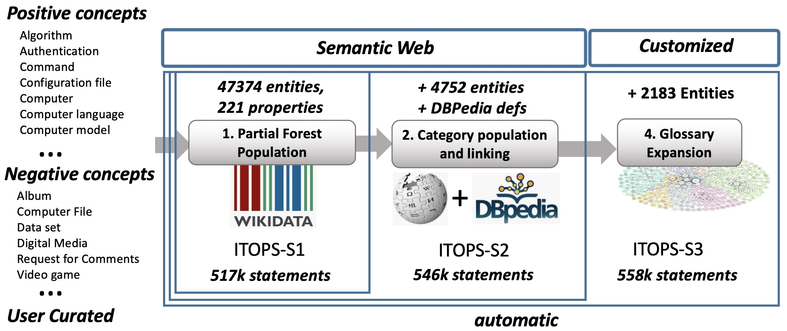
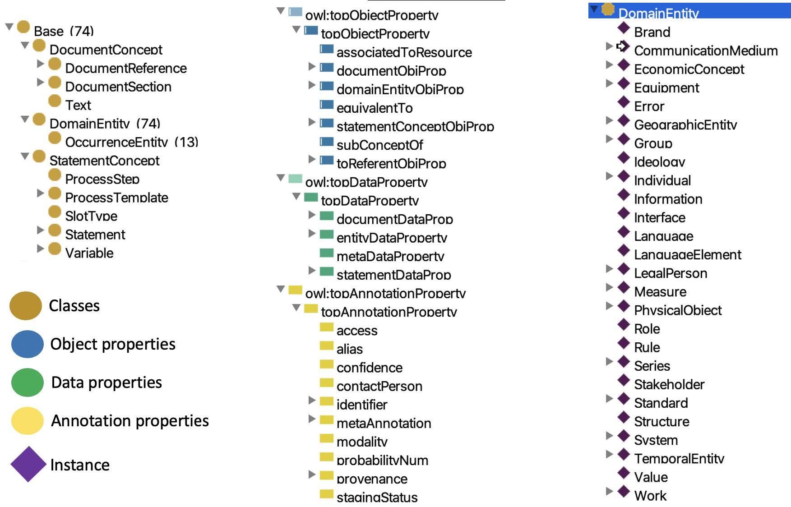

# An Ontology for IT Operations, ITOPS
Authors: Rosario Uceda-Sosa, Nandana Mihindukulasooriya, Sahil Bansal, Seema Nagar, Atul Kumar, Vikas Agarwal, Gaetano Rossiello, Alfio Gliozzo 

Special thanks to Salim Roukos, Ruchi Mahindru and Yu Deng for their help and advice. 

The IT Operations ontology is built from a domain agnostic pipeline that leverages information from Wikidata, Wikipedia and DBPedia. There are three stages in the current pipeline, each extending the previous ones by using a variety of symbolic and ML/DL techniques. 

The outcome of each stage is a turtle (.ttl) file, ITOPS_S1.ttl, ITOPS_S2.ttl and ITOPS_S3.ttl which can be deployed separately and installed in a triplestore. All of them build upon a General Library of Objects (GLO), which
provides a general ontological framework to the domain specific graphs. These files are published under Apache 2.0 license. 

Please check the ITOPS_README.pdf file for further details and sample queries. 

For questions or comments please email [rosariou@us.ibm.com](mailto:rosariou@us.ibm.com).

## ITOPS construction pipeline
The contruction pipeline aims to minimize human intervention and maximize the graph quality and richness of vocabulary already available in Wikidata, DBpedia and Wikipedia. The construction pipeline itself is domain agnostic and we’ve used it in other domains such as finance, world events, pandemics, oil and gas.

The following figure illustrates the main sections of the pipeline, which yield the three stages,  namely  S1,  S2  and  S3.  We start with a set of `seed concepts` to be populated and linked, as well as an optional set of `negative concepts` that are not to be populated. These concepts can be defined by usersor obtained from common entities in text. Our pipeline builds and saturates the graph defined by these seed concepts using Wikidata in a `Partial Forest Population` process that  produces a high-quality, self-contained knowledge base, S1. Stages S2 and S3 extend the previous stages using a variety of symbolic and machine learning techniques (refer to the paper for details). 


<p align="center"> Fig. 1. Automated ontology construction pipeline from seed concepts. </p>

## The General Library of Objects (GLO) Upper Ontology
In order to enable a domain-agnostic pipeline, we have created a small, general T-Box describing domain entities (glo:DomainEntity), statements about these entities and a set of high-level relations among them. We have populated it with 74 general-purpose entities derived from Wikidata. These entities are instances of glo:DomainEntity and are mostly related by a partial order relation, glo:subConceptOf, which subsumes wdt:P279 (subclass of) and wdt:P31 (instance of). Formally, glo:subConceptOf is the fixpoint of (wdt:P279 OR wdt:P31). We call the T-Box plus seed A-Box the General Library of Objects (GLO), and it is defined using OWL RL dialect of OWL-2, whose queries and optimization tasks can be efficiently computed.


<p align="center"> Fig. 2. The GLO Upper Ontology </p>

## How to query the ITOPS ontology

In this section, we illustrate few example queries to extract information from the IT Operations ontology. 

---
#### List programming languages associated to different Adobe software products.

```sparql
prefix glo: <http://www.ibm.com/GLO#>
prefix itops: <http://www.ibm.com/ITOPS#>
prefix rdfs: <http://www.w3.org/2000/01/rdf-schema#>

SELECT DISTINCT ?value ?valueLabel WHERE {
 ?item glo:subConceptOf itops:Software .
 { 
   ?item rdfs:label ?itemLabel.
   FILTER (CONTAINS(LCASE(?itemLabel), "adobe")) .
 } UNION {
   ?item glo:alias ?alias .
   FILTER (CONTAINS(LCASE(?alias), "adobe")) .
 }
 ?item itops:programming_language ?value .
 OPTIONAL { ?value rdfs:label ?valueLabel . }
}
```
---
#### Find free semantic reasoners that work accross multiple operating systems. 

```sparql
prefix glo: <http://www.ibm.com/GLO#>
prefix itops: <http://www.ibm.com/ITOPS#>

SELECT DISTINCT ?software ?label WHERE {
 ?software glo:subConceptOf itops:Free_software .
 OPTIONAL { ?software rdfs:label ?label  } .
 ?software itops:implementation_of itops:Semantic_reasoner .
 ?software itops:operating_system itops:Cross_platform .
}
```
---
#### List software products with the GPL-3.0 license along with their developers. 

```sparql
prefix glo: <http://www.ibm.com/GLO#>
prefix itops: <http://www.ibm.com/ITOPS#>
prefix rdfs: <http://www.w3.org/2000/01/rdf-schema#>

SELECT DISTINCT ?software ?developer WHERE {
 ?software glo:subConceptOf itops:Software .
 ?software <http://www.ibm.com/ITOPS#copyright_license> "GPL-3.0" .
 ?software <http://www.ibm.com/ITOPS#developer> ?developer .
}
```
---
#### List all properties in the IT Operations Ontology (datatype, object, and annotation)
```sparql
prefix glo: <http://www.ibm.com/GLO#>
prefix itops: <http://www.ibm.com/ITOPS#>
prefix rdfs: <http://www.w3.org/2000/01/rdf-schema#>

SELECT DISTINCT ?property ?propertyLabel WHERE {
 {
     ?property rdfs:subPropertyOf glo:topObjectProperty .
 } UNION {
     ?property rdfs:subPropertyOf glo:topDatatypeProperty .
 } UNION {
     ?property rdfs:subPropertyOf glo:topAnnotationProperty .
 }
 ?property rdfs:label ?propertyLabel .
```
---
#### List all domain entities in the IT Operations Ontology.
```sparql
prefix glo: <http://www.ibm.com/GLO#>
prefix rdfs: <http://www.w3.org/2000/01/rdf-schema#>

SELECT DISTINCT ?entity ?entityLabel WHERE {
 ?entity glo:subConceptOf glo:DomainEntity .
 ?entity rdfs:label ?entityLabel .
} 
```
---
#### Extract the two hop graph starting from the entity - itops:Laptop_model.
```sparql
prefix glo: <http://www.ibm.com/GLO#>
prefix ITOPS: <http://www.ibm.com/ITOPS#>
CONSTRUCT {
    ?x0 ?p0 ?x1 .
    ?x0 ?p1 ?x2 .
    ?x2 ?p2 ?x3 .
} WHERE {
   VALUES ?x0SUP { <http://www.ibm.com/ITOPS#Laptop_model> }
   VALUES ?x3SUP { <http://www.ibm.com/ITOPS#ITEntity> }
   ?x0 glo:subConceptOf ?x0SUP .
   ? x3 glo:subConceptOf ?x3SUP .
   #Only domain properties
   ?p0 rdfs:subPropertyOf <http://www.ibm.com/GLO#domainEntityObjProp> .
   FILTER (?p0 != <http://www.ibm.com/GLO#domainEntityObjProp> ).
   ?p1 rdfs:subPropertyOf <http://www.ibm.com/GLO#domainEntityObjProp> .
   FILTER (?p1 != <http://www.ibm.com/GLO#domainEntityObjProp> ).
   ?p2 rdfs:subPropertyOf <http://www.ibm.com/GLO#domainEntityObjProp> .
   FILTER (?p2 != <http://www.ibm.com/GLO#domainEntityObjProp> ).
   ?x0 ?p0 ?x1 .
   ?x0 ?p1 ?x2 .
   ?x2 ?p2 ?x3 .
}
```


